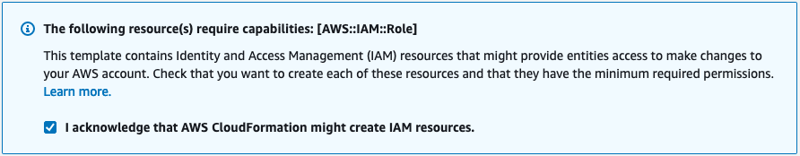

Once the prerequisites have been satisfied proceed with the deployment steps below.

1.  To download the template, you can either clone the repo with the git command below, or [**download**](https://github.com/FortinetCloudCSE/fortimanager-aws-standalone-cloudformation) the repo as a ZIP archive.  The template is in the **/cloudformation folder**

```
git clone https://github.com/FortinetCloudCSE/fortimanager-aws-standalone-cloudformation.git
```


2.  Login to your AWS account.  In the AWS services page under All Services > Management Tools, select CloudFormation.

	

3.  Select Create Stack then select with new resources.

	

4.  On the Select Template page, under the Choose a Template section select Upload a template to Amazon S3 and browse to your local copy of the chosen deployment template.

	

5.  On the Specify Details page, you will be prompted for a stack name and parameters for the deployment.  We are using the **'FortiManager_Standalone_ExistingVPC.template.json'** template which deploys a FMG into an existing VPC's public & private subnets and gives options for configuring the instance settings.

 
If the FMG is deployed into a public subnet, this hould have a default route to an Internet Gateway or bootstrapping the config and license of the FMG will fail.

If the FMG is deployed into a private subnet, this subnet should have a S3 Gateway endpoint associated to the subnet's route table.  Otherwise, provide the relevant route table ID and the template will deploy a S3 gateway endpoint for you.  Reference [**AWS Documentation**](https://docs.aws.amazon.com/vpc/latest/privatelink/vpc-endpoints-s3.html) for further information.



6.  In the FortiManager Instance Configuration parameters section, we have selected an Instance Type and Key Pair to use, chose to encrypt both OS and Log disks, as well as Flex licensing.  Notice we are prompted for the licensing type which we are going with tokens.  In our case we do not need to fill out the InitS3Bucket parameter.

7.  In the Interface IP Configuration for the FortiManager parameters section, we are going with the defaults in this example as the subnet addressing matches.  This IP will be the primary IP assigned to the FortiManager ENI.

8.  On the Options page, you can scroll to the bottom and select Next.

9.  On the Review page, scroll down to the capabilities section.  As the template will create IAM resources, you need to acknowledge this by checking the box next to ‘I acknowledge that AWS CloudFormation might create IAM resources’ and then click Submit.

	

10.  On the main AWS CloudFormation console, you will now see your stack being created.  You can monitor the progress by selecting your stack and then select the Events tab.


11.  Once the stack creation has completed successfully, select the Outputs tab to get the login information for the FortiManager instance.


12.  This concludes the template deployment example.
